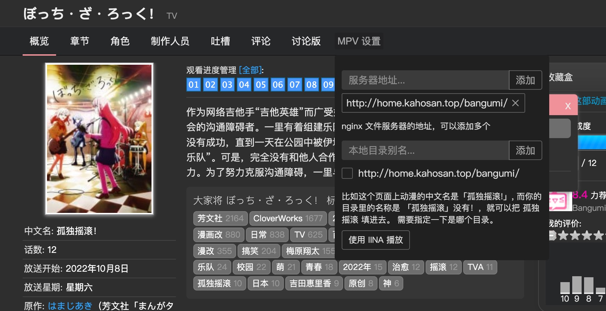
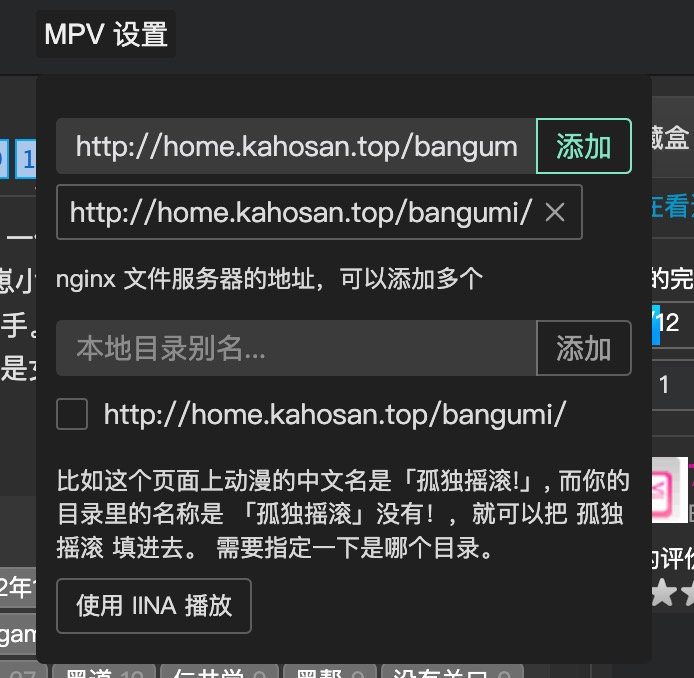
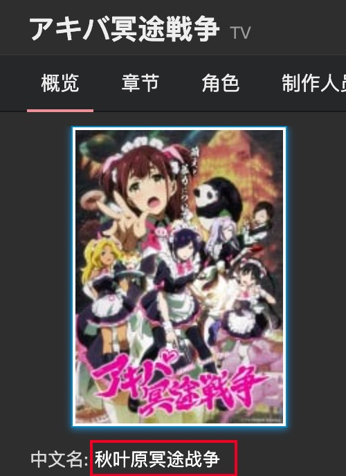
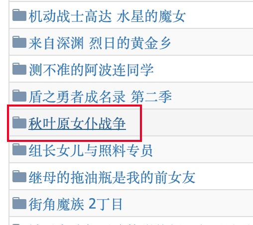
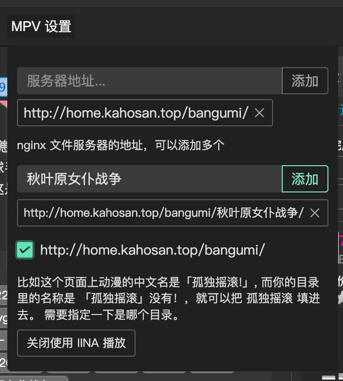

<h1 align="center">Bangumi-MPV</h1>

## 介绍

Bangumi-MPV 是一个用来点击网页的剧集便自动使用 MPV 打开本地目录的视频文件的脚本，支持 Windows、Linux、MacOS。

MacOS 需要安装 [IINA](https://github.com/iina/iina) 播放器，并点击 MPV设置 中的 `使用 IINA 播放`
其他平台需要先安装 [mpv-handler](https://github.com/akiirui/mpv-handler/blob/main/README.zh-Hans.md) 用来注册 MPV 的 URL Protocol。

安装好后可以在任意一个动漫的概览界面看到它 [示例](https://bgm.tv/subject/328609)。


## 安装

需要先安装 [tampermonkey](https://www.tampermonkey.net/) 扩展。
然后在 [greasyfork](https://greasyfork.org/zh-CN/scripts/442194-bangumi-mpv) 安装脚本。

保存动漫文件的服务器或你的电脑需要安装 `nginx` 并设置好目录浏览功能，可以参考以下设置

```nginx
server {
  listen 80; # 443 也可以，需要配置 ssl
  server_name bangumi.example.com; # 你的域名 用 IP 访问也可以

  charset utf-8;
  autoindex on;
  autoindex_localtime on;
  autoindex_exact_size off;

  location /bangumi {
    root /path/to/your/anime/folder; # 你的动漫文件夹
  }
}
```

动漫文件夹的结构需要是这样的。可以有带嵌套的文件夹，但不要有多个视频文件在剧集的目录下。

脚本会自动找到目录下的 **第一个视频文件**，如果没有找到会 **按顺序找嵌套的目录** 下的 **第一个视频文件** 并播放。

```
├── 孤独摇滚！
│   ├── 1
│   │   └── [ZhuaZhuaSub][Bocchi the Rock!][01][CHS_JP][AVC_AAC][1080P][WEBRip][MP4]
│   │       └── [ZhuaZhuaSub][Bocchi the Rock!][01][CHS_JP][AVC_AAC][1080P][WEBRip][MP4].mp4
│   ├── 2
│   │   └── [ZhuaZhuaSub][Bocchi the Rock!][02][CHS_JP][AVC_AAC][1080P][WEBRip][MP4]
│   │       └── [ZhuaZhuaSub][Bocchi the Rock!][02][CHS_JP][AVC_AAC][1080P][WEBRip][MP4].mp4
│   ├── 3
│   │   └── [ZhuaZhuaSub][Bocchi the Rock!][03][CHS_JP][AVC_AAC][1080P][WEBRip][MP4]
│   │       └── [ZhuaZhuaSub][Bocchi the Rock!][03][CHS_JP][AVC_AAC][1080P][WEBRip][MP4].mp4
├── 盾之勇者成名录 第二季
│   ├── 1
│   │   └── [Tate no Yuusha no Nariagari S2][01][BIG5][1080P].mp4
│   ├── 2
│   │   ├── 《盾之勇者成名錄 第二季》#2 (日文自動產生字幕)【Ani-One ULTRA】.ass
│   │   ├── 《盾之勇者成名錄 第二季》#2 (日語原聲)【Ani-One ULTRA】.mp4
│   │   ├── 《盾之勇者成名錄 第二季》#2 (簡中字幕)【Ani-One ULTRA】.ass
│   │   └── 《盾之勇者成名錄 第二季》#2 (繁中字幕)【Ani-One ULTRA】.ass
│   ├── 3
│   │   ├── 《盾之勇者成名錄 第二季》#3 (日文自動產生字幕)【Ani-One ULTRA】.ass
│   │   ├── 《盾之勇者成名錄 第二季》#3 (日語原聲)【Ani-One ULTRA】.mp4
│   │   ├── 《盾之勇者成名錄 第二季》#3 (簡中字幕)【Ani-One ULTRA】.ass
│   │   └── 《盾之勇者成名錄 第二季》#3 (繁中字幕)【Ani-One ULTRA】.ass
```

## 使用

上述配置都弄好后，将你的 nginx 服务器地址 & IP 填入 MPV 设置中，点击添加。


然后点击你想看的剧集，正常情况下会弹出一个窗口询问你要打开 MPV 播放器吗，点击确定。

有一种情况是网页上的的中文名称和你的动漫文件夹中的文件夹名称不一致，比如

这里的名称是「秋叶原冥途战争」，但是我服务器上对应的文件夹的名称是「秋叶原女仆战争」


可以在 MPV设置 中设置本地目录的别名，像这样 **注意勾选对应的服务器地址**


就可以正常播放了。

## 其他

有什么问题和不解的地方欢迎提 issue，有空会回复。
欢迎 PR。

## License

MIT
